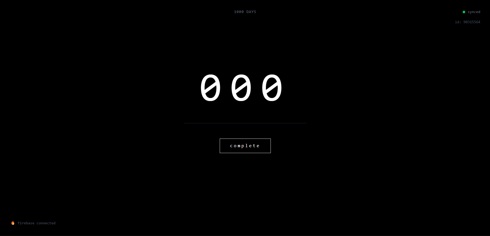

````md
# Project-1000


**Project-1000** is a minimal web app built to track daily streaks and discipline.  
The counter increases once per day and automatically resets if more than one day is missed.  
All progress is stored in Firebase, so your streaks are preserved even if you refresh or reopen the app.

---

## Table of Contents
- [Live Demo](#live-demo)
- [Features](#features)
- [Screenshot](#screenshot)
- [Tech Stack](#tech-stack)
- [Getting Started](#getting-started)
  - [Prerequisites](#prerequisites)
  - [Installation](#installation)
  - [Set up Firebase](#set-up-firebase)
  - [Run the app locally](#run-the-app-locally)
- [Deployment](#deployment)
- [Contributing](#contributing)
- [License](#license)

---

## Live Demo

Try the app here: **[streak-tracker-rouge.vercel.app](https://streak-tracker-rouge.vercel.app/)**

---

## Features

- Increments only once per day  
- Automatically resets if more than one day is missed  
- Minimal and clean design with Tailwind CSS  
- Data is stored in Firebase, so refreshing or reopening the app does not affect progress  

---

## Screenshot



*(Replace `screenshot.png` with the actual file path in your repo.)*

---

## Tech Stack

- [React](https://react.dev/) – UI framework  
- [Tailwind CSS](https://tailwindcss.com/) – styling  
- [Firebase](https://firebase.google.com/) – authentication and data storage  

---

## Getting Started

### Prerequisites
- [Node.js](https://nodejs.org/) (v16 or higher recommended)  
- [npm](https://www.npmjs.com/) or [yarn](https://yarnpkg.com/)

### Installation

1. Clone the repository:
   ```bash
   git clone https://github.com/your-username/project-1000.git
   cd project-1000
````

2. Install dependencies:

   ```bash
   npm install
   ```

   or

   ```bash
   yarn install
   ```

### Set up Firebase

1. Create a project in the [Firebase Console](https://console.firebase.google.com/)
2. Enable **Firestore Database**
3. Copy your Firebase config and create a `.env` file in the project root with the following keys:

   ```env
   VITE_FIREBASE_API_KEY=your_api_key
   VITE_FIREBASE_AUTH_DOMAIN=your_auth_domain
   VITE_FIREBASE_PROJECT_ID=your_project_id
   VITE_FIREBASE_STORAGE_BUCKET=your_storage_bucket
   VITE_FIREBASE_MESSAGING_SENDER_ID=your_sender_id
   VITE_FIREBASE_APP_ID=your_app_id
   ```

> Note: The `VITE_` prefix is required for Vite/React env variables to be exposed to the client.

### Run the app locally

```bash
npm run dev
```

---

## Deployment

Deploy easily on [Vercel](https://vercel.com/) or [Netlify](https://www.netlify.com/).

* Connect your GitHub repository.
* In your project settings, add the same environment variables shown above.
* Use the default build command (e.g., `vite` or framework auto-detection).

---

## Contributing

Contributions are welcome. Please open an issue to discuss what you would like to change, or submit a pull request with a clear description.

---

## License

This project is licensed under the [MIT License](LICENSE).

```
```
